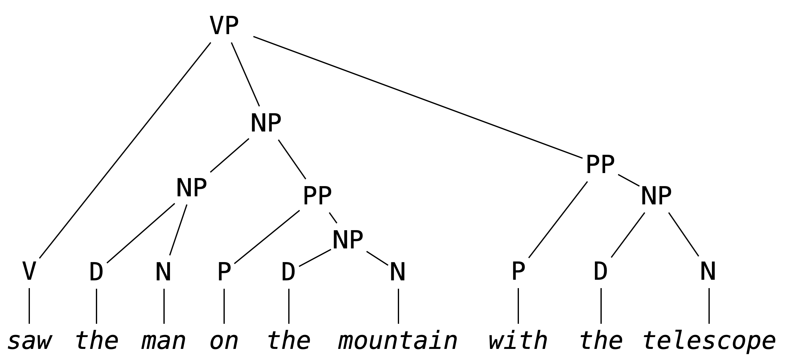
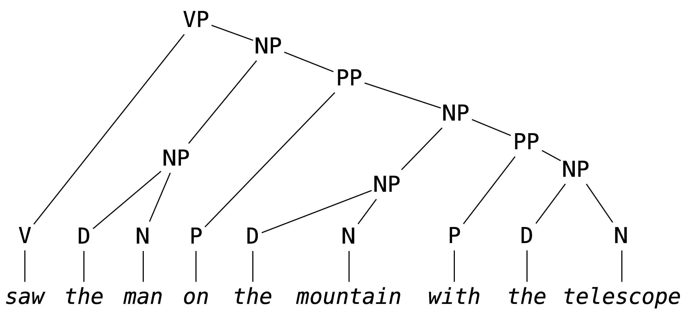
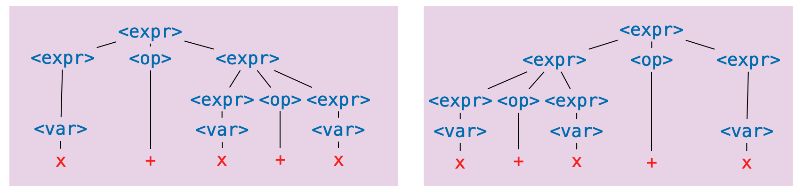

# Ambiguity

As participants of language, we are no strangers to grammatical ambiguity.
Take, for instance, the following sentence I've unapologetically snarfed from the Wikipedia article on [Syntactic Ambiguity](https://en.wikipedia.org/wiki/Syntactic_ambiguity).

```
John saw the man on the mountain with the telescope
```

Was John using the telescope?
Was the man carrying the telescope?
Are the multiple mountains, one of which has a telescope on it?

The ambiguity exists because it is not clear what hierarchical structure should scaffold this sentence.
Here are two options for the verb phrase in the sentence.



Again, not a linguistic class, but it is enough to recognize that `with the telescope` is grouped alongside the verb phrase starting with `saw`, indicating that John was *using* the telescope.
The other option (though not the *only* other option):



The prepositional phrase `with the telescope` is grouped with `the man on the mountain`, indicating the man was *carrying* the telescope.

The ambiguity comes from not being completely sure which parse tree to give to the sentence.
That is, it comes from the fact that we have to experience language in a linear fashion, either by reading it or hearing it.
If our interlocutor could *display* the parse tree of their statement (floating eerily in space before your eyes) there would be nothing to say of (grammatical) ambiguity.

But this is not how we experience language (or how we write programs, for that matter).
To drive the point home, there is a natural-enough looking grammar which recognizes the above sentence.

```
<s>  ::= <np> <vp>
<vp> ::= <v> | <v> <np> | <v> <np> <pp>
<pp> ::= <p> <np>
<np> ::= <n> | <d> <n> | <np> <pp>
<n>  ::= John | man | mountain | telescope
<v>  ::= saw
<d>  ::= the
<p>  ::= on | with
```

The ambiguity comes exactly from the fact that this grammar has two parse trees which recognize the same sentence; we don't know what structure to give the sentence.
Or equivalently, since parse trees correspond to exactly one leftmost derivation (you should try to convince yourself of this), the ambiguity comes from there being multiple leftmost derivations.

> **Exercise.** Give two leftmost derivations of `John saw the man on the mountain with the telescope` in the above grammar.

Ambiguity in natural language is a complex topic, coming not just from parse-tree ambiguity, but also from the fact that defining a formal grammar for natural language is *hard* (perhaps impossible).
But, restricted to the context of formal grammars, ambiguity has a wholly unambiguous definition.

> **Definition.** A grammar is **ambiguous** there is a sentence it recognizes which has two distinct parse trees.
> Equivalently, it is ambiguous of there is a sentence it recognizes which has two distinct leftmost derivations.

Thus, the above grammar is ambiguous in the formal sense of the word.

More to the point, consider the following grammar which may be seen as a prototype of a grammar for arithmetic expressions (something we will probably want if we're to give a grammar for a programming language).

```
<expr> ::= <var> | <expr> <op> <expr>
<op>   ::= + | - | * | /
<var>  ::= x
```

This seems, ignoring obvious issues, a reasonable enough definition; *an expression is either a variable or a pair of expressions with an operator between them*.
Note that the recursive nature of the first production rule means that this grammar recognizes an infinite number of sentence.

> **Exercise.** Give a leftmost a derivation of `x * x + x * x` in the above grammar.

But, with regards to ambiguity, we should already be wary of this grammar, in particular the first production rule.
As soon as we've applied the (second alternative of) the first production rule twice we get:

```
<expr>
<expr> <op> <expr>
<expr> <op> <expr> <op> <expr>
```

For the third line, *which of the two `<expr>` symbols did we expand?*
To make this concrete, here are two parse trees for the sentence `x + x + x`.



Corresponding to the following two leftmost derivations (the first for the tree on the left, the second for the tree on the right).

```
<expr>
<expr> <op> <expr>
<var> <op> <expr>
x <op> <expr>
x + <expr>
x + <expr> <op> <expr>
x + <var> <op> <expr>
x + x <op> <expr>
x + x + <expr>
x + x + <var>
x + x + x

<expr>
<expr> <op> <expr>
<expr> <op> <expr> <op> <expr>
<var> <op> <expr> <op> <expr>
x <op> <expr> <op> <expr>
x + <expr> <op> <expr>
x + <var> <op> <expr>
x + x <op> <expr>
x + x + <expr>
x + x + <var>
x + x + x
```

This demonstrates that the above grammar is ambiguous.

> **Aside.** In this example, and many of the examples we will see, it will be fairly clear that the grammar is ambiguous.
> As students of computer science, we might think it possible that we could write a *program* that can check for us if a grammar is ambiguous.
> Unfortunately, this is impossible (not just very difficult, but *impossible*).
> This is to say that determining if a context-free grammar is ambiguous is **undecidable** (a term worth looking up if this piques your interest).

## Avoiding Ambiguity

Our next task it to determine how to avoid this ambiguity, but first, *why should we care?*
Natural language is ambiguous and we get along perfectly fine.
Why should we go through this trouble to make sure grammars we design are unambiguous?

It's a fair question; the way I see it, it's something of a promise that we make to the user of a programming language that we **never make unspoken assumptions about what a user meant when we read one of their programs.**
To be fair, we try to do this with natural language too, but in communication, if a statement is ambiguous, we can usually just ask our interlocutor what they meant.
We can't do this for a programming language (at least not yet), so instead we make it *impossible* for a sentence to have multiple meanings.

> **Aside.** We see a similar phenomena in legal language, which tends to be grammatically sterile, and usually no fun to read (at least for me).

### (Reverse) Polish Notation

If our only concern is avoiding ambiguity, we can use *polish notation* or *reverse polish notation*.
In polish notation, operators appear *before* all their arguments, e.g.,

```
<expr> ::= <var> | <op> <expr> <expr>
<op>   ::= + | - | * | /
<var>  ::= x
```

We won't dwell on this but it turns out this gives us an unambiguous grammar, we don't even need parentheses.

And it's not difficult to imagine what reverse polish notation is: operators always appear *after* all their arguments.
This is how early calculators (like the [HP 9100A Desktop Calculator](https://en.wikipedia.org/wiki/Hewlett-Packard_9100A), before my time) were designed.
If you wanted to compute something `(2 + 3) * (4 - 5)`, you would *push* the values you want to apply operations to onto a *stack*, and then apply operations to the top elements of the stack, like so:

```
STACK        RPN EXPRESSION
2            2
2 3          2 3
5            2 3 +
5 4          2 3 + 4
5 4 5        2 3 + 4 5
5 (-1)       2 3 + 4 5 -
(-5)         2 3 + 4 5 - *
```

So the sequence of tokens you end up typing into the calculator is an expression in reverse polish notation.

> **Exercise.** Derive the sentence `+ * x * x - x x x x` in the above grammar.

The obvious issue with (reverse) polish notation is that it is difficult to read.
Imagine working with a language in which if-then-else logic had to be done like:

```
IFTHENELSE
  cond
  IFTHENELSE
    IFTHENELSE
	  cond
      ifcase
	  elsecase
    ifcase
	elsecase
  elsecase
```

This is in part to say that what truly causes ambiguity in expressions is the *mixing* of operator *fixity*.

> **Definition.** The **fixity** of an operator refers to where the (syntactic components of an) operator is placed relative to its arguments.
> There are four kinds of operator fixity.
> * A **prefix** operator appears before its arguments. This is like function application in OCaml (e.g., `f x` or `not b`).
> * A **postfix** operator appears after its arguments. This is like type constructor application in OCaml (e.g., `int list` or `bool option list`).
> * An **infix** operator appears in between its arguments. This is like arithmetic operations we learn in primary school (e.g., `2 + 3` or `4 / 5`).
> * A **mixfix** operator is an operator with multiple syntactic components which may appear as some combination of prefix, infix and postfix. This is like if-then-else expressions in OCaml (e.g., `if b then x else y`).

So if we want to contend with operator fixity (i.e., we don't want *just* prefix or *just* postfix operators, as in polish notation or reverse polish notation) then we still have work to do to avoid ambiguity.

### Parentheses

Another simple solution is to surround applications of operations with parentheses:

```
<expr> ::= <var> | ( <expr> <op> <expr> )
<op>   ::= + | - | * | /
<var>  ::= x
```

It then becomes very clear in a derivation like

```
<expr>
( <expr> <op> <expr> )
( ( <expr> <op> <expr> ) <op> <expr> )
```

which `<expr>` in the second line we expanded.
But we run into a similar issue; *lots of parentheses are no fun to read.*

> **Exercise.** Give a derivation of `( ( ( x * x ) * x ) + ( x / x ) )` in the above grammar.

So, our real basic question is: **how do we avoid grammar while being able to mix operator fixities and not use so many parentheses?**
And this question has a simple answer in theory: **make explicit assumptions about how operator arguments are grouped.**
This will mean contending with two things: *associativity* and *precedence*.

## Dealing with Associativity

Associativity refers to how arguments are grouped when we are given a sequence of applications of an infix operator in the absence of parentheses, e.g.,

```
x + x + x + x
```

may be understood as any one of the following (among others):

```
(((x + x) + x) + x)
(x + (x + (x + x)))
((x + x) + (x + x))
(x + ((x + x) + x))
```

> **Exercise.** Determine the number of ways the expression `x + x + x + x` can be parenthesized.

In the case of addition (as we typically understand it) this point is somewhat moot.
The order in which we group arguments does not affect the *value* of a sequence of additions.
That is, addition is associative (a term whose meaning we may recall from our discussion of list folding).

> **Definition.** An operator `#` is **associative** if
> ```
> (a # b) # c = a # (b # c)
> ```
> for any values `a`, `b`, and `c` for which the above two expressions are defined.

But not all operators are associative.
Take division for example.
We need to decide how to implicitly parenthesize an expression like `a / b / c / d`.
Again, we could try to bar the ability to write an expression like this, but we might rather avoid using parentheses if possible.

> **Exercise.** How does OCaml evaluate the expression `100 / 5 / 4`?
> How are arguments grouped?

For binary operators, we typically choose one of the first two choices in the list of parenthesizations above.

> **Definition.** A operation `#` is said to be **left-associative** if sequences of applications of the operator are understood as grouping arguments from the left, i.e.,
> ```
> a # b # c # d = (((a # b) # c) # d)
> ```
> and is said to be **right-associative** if arguments are grouped from the right, i.e.,
> ```
> a # b # c # d = (a # (b # (c # d)))
> ```

> **Remark.** Another option is that a binary operator can have no associativity.
> It does not, for instance, make sense to apply a sequence of `=` operators in OCaml.

Bringing this back to grammatical ambiguity, giving a parenthesization of a sequence of operators means specifying a "shape" for the corresponding parse tree.
For example, taking addition to be left-associative, i.e., taking `x + x + x` to mean `((x + x) + x)`, implies that, of the two parse trees for this sentence in the above image, the one on the *right* should be the "correct" one, **not** the one on the left.
So: *can we update the grammar so that only the one on right can be constructed?*

Let's take a simpler case first: consider another grammar, used to generate function types on integers in OCaml without parentheses.

```
<fun-type> ::= <int-type> | <fun-type> -> <fun-type>
<int-type> ::= int
```

> **Exercise.** Give two leftmost derivations of `int -> int -> int` in the above grammar.

We might recall that function types are right associative, so we understand `int -> int -> int` to be parenthesized implicitly as `int -> (int -> int)`.
The problem, as it stands, is that because of the production rule

```
<fun-type> ::= <fun-type> -> <fun-type>
```

the argument type can an arbitrary complex function type.
But we might recognize that, no matter how deep the nesting, the argument types have the special property in the case we assume right associativity: *they are it is always just `int`*.
Therefore, we might consider the following updated grammar.

```
<fun-type> ::= <int-type> | <int-type> -> <fun-type>
<int-type> ::= int
```

In this grammar, no matter how many times you apply the second alternative of the first production rule, the argument type is always just the `int` type.
So we were, in fact, able to restrict the shape of the parse tree for sentences, by *breaking the symmetry* the production rule.

> **Exercise.** Write the leftmost derivation of `int -> int -> int` in the above grammar, along with its parse tree.

We'll come back to this, but first we have to recognize an issue with the example just given: there is only one operator.
In the presence of multiple operators we have new issues to deal with.
*How should `x * y + z` or `x + y - z` be implicitly parenthesized?*

This is an issue of *precedence* or *order of operations* something probably already somewhat familiar with without necessarily knowing it.

## Dealing with Precedence

If you went through the American public school system then you probably learned the abbreviation PEMDAS (**P**arentheses, **E**xponentiation, **M**ultiplication, **D**ivision, **A**ddition, **S**ubtraction, along with an accompanying mnemonic, something like **P**lease **E**xcuse **M**y **D**ear **A**unt **S**ally).
Focusing on just the last four letters for now, this rule tells us that we should group multiplications and divisions first, and then group addition and subtraction.
That is to say, multiplication and division have greater *precedence* than addition and subtraction.

> **Definition.** The **precedence** of an operator, relative to another operator, determines which operator binds more tightly, in the presents of ambiguity.

> **Example.** The expression `2 * 3 + 4 * 5` should be implicitly parenthesized as `((2 * 3) + (4 * 5))` because multiplication binds tighter, it is considered first.

Just as with associativity, the relative precedence of a collection of operators is about determining the shape of the parse tree we get when we generate the sentence with a grammar.
To say that multiplication has higher precedence is to say that when we build the parse tree for `x * x + x`, we want `+` to be the top-level operation, at the root of the tree.

> **Remark.** One thing that was probably glossed over if/when you learned PEMDAS: what do you do with something like `1 + 1 - 1 + 1`?
> Do you group additions and then subtractions? Or vice versa?
> The issue here is that addition and subtraction have the *same* precedence.
> In this case, we will use the associativity of the operators to determine how to parenthesize: **given a sequences of operators of the same precedence, we use their associativity to group them.**
>
> Since addition and subtraction are both left-associative, this would be parenthesized as (((1 + 1) - 1) + 1).
> Things can get *truly* complicated if you have two operators with the *same* precedence, but *different* associativity.
> We will ignore this possibility in this course, but this really matters in languages like Haskell, in which users can define their own operators, with specified precedence and associativity.

All of this is to say: in order to define an unambiguous grammar without parentheses, we need to know three things of each operator appearing in the grammar: **fixity**, **associativity**, and **precedence**.
We can, for example, present the four basic arithmetic operators along with this information.
It is typical to represent precedence by a positive integer, in which an operator has higher precedence than another if its precedence value is larger.

| Operator | Fixity | Associativity | Precedence |
|-|-|-|-|
| `*` | infix | left | 2 |
| `/` | infix | left | 2 |
| `+` | infix | left | 1 |
| `-` | infix | left | 1 |

> **Remark.** This information is also available for all [OCaml operators](https://v2.ocaml.org/api/Ocaml_operators.html).

With all this, we can now think about how to build an unambiguous grammar for arithmetic expressions.
Just as with associativity, we need to recognize that a couple things:
* Because of associativity, the right argument of multiplication or division must be a variable `x`.
* Because of precedence, the left argument of multiplication or division must contain only multiplications and divisions.
* Because of associativity, the right argument of addition or subtraction must be an expression with only multiplications and divisions.

These observations yields the following grammar.
I've tried to use suggestive names to indicate how the three points above manifest.

```
<expr>         ::= <only-mul-div> | <expr> <add-sub> <only-mul-div>
<only-mul-div> ::= <var> | <only-mul-div> <mul-div> <var>
<add-sub>      ::= + | -
<mul-div>      ::= * | /
<var>          ::= x
```

> **Exercise.** Give the leftmost derivation of `x * x + x * x` in the above grammar. Draw its parse tree

Proving that this grammar is unambiguous is a bit tricky (we won't do this).
It suffices to say that, given we know how to parenthesize such expressions, and this grammar captures the rules we use, it would seem to be ambiguous.

## Parentheses (Again)

We're not quite done.
Without parentheses, we can't derive all expressions we might want to write down.
Given the rules we've described above, we cannot write an expression (without parentheses) which is equivalent to `(x + x) + x`.
To give a complete specification of the arithmetic expressions we know and love, we have to add back parentheses (this is the "P" part of PEMDAS).

But where should we put parentheses into the grammar?
As we saw above, if we put them everywhere, we get unnecessarily verbose sentences.
Rather, it should be the case that: *it should be possible put **any** expression as an argument to operator if it is wrapped in parentheses.*
For this we will replace `<var>` with something can also be any expression wrapped in parentheses.

```
<expr>          ::= <only-mul-div> | <expr> <add-sub> <only-mul-div>
<only-mul-div>  ::= <var-or-parens> | <only-mul-div> <mul-div> <var-or-parens>
<add-sub>       ::= + | -
<mul-div>       ::= * | /
<var-or-parens> ::= x | ( <expr> )
```

We might worry that now, it is again possible to have an arbitrary expression as an argument to an operator, but the point is that, if we do this, it must be wrapped in parentheses, which ensures unambiguity.

> **Exercise.** Give a leftmost derivation of `( x + x ) * x` in the above grammar. Draw its parse tree.

> **Exercise.** According to PEMDAS, we also need to handle exponentiation.
> Give a grammar for arithmetic expressions including parentheses and exponentiation, using the following operator information.
> | Operator | Fixity | Associativity | Precedence |
> |-|-|-|-|
> | `^` | infix | right | 3 |
> | `*` | infix | left | 2 |
> | `/` | infix | left | 2 |
> | `+` | infix | left | 1 |
> | `-` | infix | left | 1 |

> **Exercise.** Write a grammar for Boolean expressions in Python.
> You can check what sorts of expressions are allowed by using the Python interpreter.
