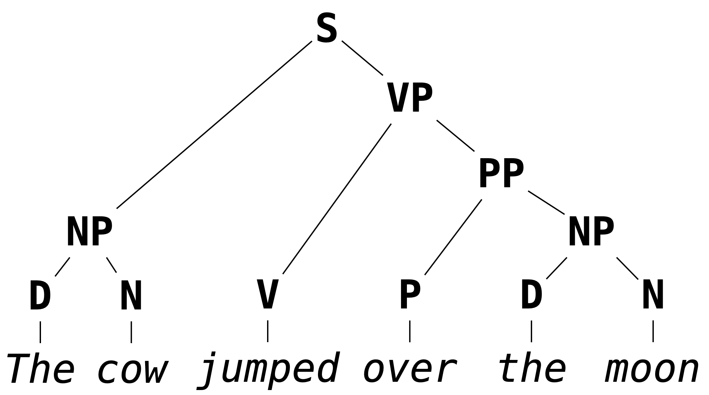

# Formal Grammar

Most of us are likely familiar with grammar in the context of natural language.
In a primary school English class, we might learn that we should use the artical "an" instead of "a" if its corresponding noun starts with a vowel sound, or that what follows a semicolon should be a independent clause (i.e., should be able to stand on its own as a complete sentences).
These are examples of English *grammar rules*.

Grammar, in broad strokes, refers to the rules which govern what constitutes a well-formed sentence in a given language, barring low-level syntactic concerns like spelling or white space.
It is the concern of grammar to determine that

```
I taught the car in the refrigerator
```

makes grammatical sense and that

```
I car teach refrigerator in there
```

does not.
It is *not* the concern of grammar to determine that the first sentence, though grammatical, has no reasonable interpretation in English (except, perhaps, in surrealist fiction).

Programming languages─being themselves languages in their own right, albeit more stringent ones than natural languages─have their own grammars, i.e., rules for determining what counts as a well-formed program.
Due to this requirement of grammatic precision, they tend to be called *formal grammars*.
In OCaml
```ocaml
let f x = x + 1
```
is a well-formed program but
```ocaml
let f x = x 1 +
```
is not, because the rule for using the `+` operator is that its arguments appear to its left and its right.
That is, it is an *infix operator* (it can be used as a prefix operator if put in parentheses, e.g. `(+) x 1`, but it cannot in any circumstances be used as a postfix operator).
We will discuss fixity in more detail later.

As in the case of natural language, grammars for programming languages are not concerned with the *meaning* of programs, just their well-formedness:

```
let omega x = x x
```

is a well-formed program in OCaml, but it does not type-check since the argument `x` is expected to be a function of type `'a -> 'b` as well as an argument of type `'a`, an impossibility in the type system of OCaml.

If our goal is to interpret computer programs, then we have to understand formally─both theoretically and practically─the grammars describing the well-formed programs in those languages.
This means being able to represent and interpret representations of formal grammars.
The grammar of OCaml, for example, is given in its entirety in [The OCaml Manual](https://v2.ocaml.org/manual/expr.html).
The hope is that, after these notes, you should be able to understand the specification given there.

Placing this in the pipeline of interpretation we discussed in the previous chapter, grammar is used to represent the output of parsing (which we will take up in the following chapter).
As a reminder, a stream of tokens is parsed into a *parse tree*, a hierarchical structure which describes the way the program is formally composed.
As we saw, it is easier to determine the meaning of a program (i.e., to interpret it) given its hierarchical structure as opposed to its linear form as a stream of tokens.

This is another way of conceptualizing the role of grammar: it determines the hierarchical structure of a sentence.
A sentence may be considered well-formed if it can constructed as well-formed parse tree, e.g.


Its not important that you know/remember exactly what you each of the abbreviations in the above image stand for (this is not a linguistics course or an English grammar course) but hopefully the structure aligns with your intuition about how words in the sentences are grouped.

### Summary
In the remainder of these notes we will:

* define *Backus-Naur Form*, a way of specifying so-called *context-free grammars*, which we will use to describe the grammars of programming languages;
* discuss *ambiguity* in grammar and how to avoid it;
* take a brief detour to talk about regular grammars and regular expressions;
* cover implementation concerns, i.e., how this fits into the building of an interpreter;

## Backus-Naur Form (BNF)

Backus-Naur Form (BNF) specifications are used to describe what are called *context-free grammars*.
Context-free grammars form a class of formal grammars which are sufficiently expressive to capture the grammars of most programming languages.
We will be using BNF specifications to describe the rules which determine well-formed programs in programming languages we aim to interpret.
First, a toy example/thought experiment.

### Thought Experiment

Consider again the following English statement.

```
The dog jumped over the moon
```

Suppose we were to try to break down the cognitive process required to determine that this sentence is grammatical.
We might first recognize that each word falls into a particular part of speech.
We can represent this part of the process by replacing each word in the sentence with a symbol *standing for* the figure of speech for each word.

```
<article> <noun> <verb> <prep> <article> <noun>
```

We then might recognize some familiar patterns: the pattern `<article> <noun>` is used to determine or quantify a noun, so might mentally group these symbols (into what grammaticist calls a *nominal phrase* or *noun phrase*) and represent them by a new symbol.

```
<noun phrase> <verb> <prep> <noun phrase>
```

Then we might recognize that a preposition followed by a noun phrase is also single unit (e.g., "over the moon", "through the woods", and "behind the wall" are examples of *prepositional phrases*) which may represent as something like

```
<noun phrase> <verb> <prep phrase>
```

and that a verb followed by a prepositional phrase is, again, a single unit (e.g., "ran to the car", "arose from bed") leaving us with

```
<noun phrase> <verb phrase>
```

the canonical structure of a sentence: *a thing does a thing.*
A bit hand-wavy, but this accounts roughly for what we do when we judge that the above sentence is grammatical.

Putting these steps in reverse order, and starting with a single symbol `<sentence>` we get something that looks like a "proof" that `the dog jumped over the moon` is a valid sentence.

```
<sentence>
<noun phrase>    <verb phrase>
<noun phrase>    <verb> <prep phrase>
<noun phrase>    <verb> <prep> <noun phrase>
<article> <noun> <verb> <prep> <article> <noun>
the       dog    jumped over   the       moon
```

And if we squint, we can see something that looks a bit like the tree above:



### Definitions

A *formal grammar* is meant to model this cognitive process of classifying a sentence as grammatical by verifying that it has a reasonable hierarchical structure.
In defining a formal grammar, we have to fix ourselves to a collection of symbols.
These symbols are divided into two disjoint groups: the **terminal symbols** and the **non-terminal symbols**.
Two persnickety but important details about symbols:
* In what follows (and as above) we will always notate a non-terminal symbol by something of the form `<non-term>` (where we replace `non-term` with something more descriptive) and terminal symbols by any sequence of (typically) alphanumeric symbols (in particular, we will avoid using `<` and `>` in the notation of terminal symbols so as not to cause any confusion).
* We typically will not state outright what the underlying symbols of a grammar are.
  As we will see, it will be possible to determine what terminal and non-terminal symbols we are considering by looking at the BNF specification itself.


In the "proof" that we gave that `the dog jumped over the moon` was grammatical, we built a sequence of not-quite sentences, until the very last one which was an actual sentences. We call these not-quite sentences *sentential forms*.

> **Definition.**
> A **sentential form** is a sequence of symbols (terminal or non-terminal).
> A **sentence** is a sequence of terminal symbols.

In the (reversed) process of building sentential forms, we replaced non-terminal symbols with sentential forms, e.g., we replaced `<noun phrase>` with `<article> <noun>`.
A grammar is determined by what replacements we are allowed to do.
> **Definition.** A **production rule** is an equation of the form
> ```
> <non-term> ::= SENTENTIAL-FORM
> ```
> where the left-hand side of the `::=` is a non-terminal symbol, and the right-hand side is a sentential form.
> A **BNF specification** is a collection of production rules in which one rule is designated the **starting symbol**.

We read a production rule as saying "The non-terminal symbol on the left-hand side can be replaced with the sentential form on the right hand side".
In these notes, the start rule will be designated as the first rule appearing in a specification.

The following is an example of a grammar which we will show to *recognize* the sentence above.
```
<sentence>    ::= <noun phrase> <verb phrase>
<verb-phrase> ::= <verb> <prep phrase>
<verb-phrase> ::= <verb>
<prep-phrase> ::= <prep> <noun phrase>
<noun-phrase> ::= <article> <noun>
<article>     ::= the
<noun>        ::= cow
<noun>        ::= moon
<verb>        ::= jumped
<prep>        ::= over
```

Note that a non-terminal symbol can have multiple associated production rules.
This is common enough that we have special syntax for this.

> **Notation.** We will write
> ```
> <non-term> ::= SENT-FORM-1 | SENT-FORM-2 | ... | SENT-FORM-n
> ```
> as shorthand for
> ```
> <non-term> ::= SENT-FORM-1
> <non-term> ::= SENT-FORM-2
> ...
> <non-term> ::= SENT-FORM-n
> ```
With this shorthand, we can simply the above grammar:
```
<sentence>    ::= <noun phrase> <verb phrase>
<verb-phrase> ::= <verb> | <verb> <prep phrase>
<prep-phrase> ::= <prep> <noun phrase>
<noun-phrase> ::= <article> <noun>
<article>     ::= the
<noun>        ::= cow | moon
<verb>        ::= jumped
<prep>        ::= over
```

The last piece of the thought experiment above is the "proof" that the given sentence was grammatical.
We codify this in the notion of a *derivation*.

> **Definition.** A **derivation** of a sentence `S` in a BNF grammar is a sequence of sentential forms with the following properties:
> * it beginning with the start symbol
> * it ends in `S`
> * each sentential form is a the result of replacing *one of* the non-terminal symbols in the preceding sentence with a sentential form according to a production rule of the grammar.

That's a bit of a mouthful, but it essentially restates the process in the thought experiment in a formal way.
There is one deviation from the process above, included to make the definition easier to state: above we allowed ourselves to replace multiple non-terminal symbols simultaneously.
A "correct" derivation would look like
```
<sentence>
<noun-phrase> <verb-phrase>
<noun-phrase> <verb> <prep-phrase>
<noun-phrase> <verb> <prep> <noun-phrase>
<article> <noun> <verb> <prep> <noun-phrase>
<article> <noun> <verb> <prep> <article> <noun>
the <noun> <verb> <prep> <article> <noun>
the dog <verb> <prep> <article> <noun>
the dog jumped <prep> <article> <noun>
the dog jumped over <article> <noun>
the dog jumped over the <noun>
the dog jumped over the moon
```

## Ambiguity

## Extended BNF

## Regular Grammars and Regular Expressions

## Implementation Concerns
