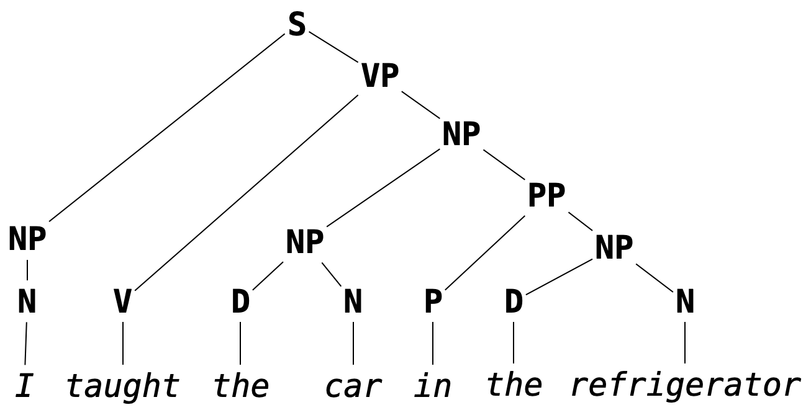

# Formal Grammar

Most of us are likely familiar with grammar in the context of natural language.
In a primary school English class, we might learn that we should use the artical "an" instead of "a" if its corresponding noun starts with a vowel sound, or that what follows a semicolon should be a independent clause (i.e., should be able to stand on its own as a complete sentences).
These are examples of English *grammar rules*.

Grammar, in broad strokes, refers to the rules which govern what constitutes a well-formed sentence in a given language, barring low-level syntactic concerns like spelling or white space.
It is the concern of grammar to determine that

```
I taught the car in the refrigerator
```

makes grammatical sense and that

```
I car teach refrigerator in there
```

does not.
It is *not* the concern of grammar to determine that the first sentence, though grammatical, has no reasonable interpretation in English (except, perhaps, in surrealist fiction).

Programming languages─being themselves languages in their own right, albeit more stringent ones than natural languages─have their own grammars, i.e., rules for determining what counts as a well-formed *program*.
Due to the grammatic precision expected of programming languages (we don't want too much variation in what we are allowed to write as a valid program), these tend to be called *formal grammars*.

> **Example.** In OCaml, the program
> ```ocaml
> let f x = x + 1
> ```
> is well-formed, but the program
> ```ocaml
> let f x = x 1 +
> ```
> is not, because the rule for using the `+` operator is that its arguments appear to its left and its right.
> That is, it is an *infix operator* (it can be used as a prefix operator if put in parentheses, e.g. `(+) x 1`, but it cannot in any circumstances be used as a postfix operator).
> We will discuss fixity in more detail later.

As in the case of natural language, grammars for programming languages are not concerned with the *meaning* of programs, just their well-formedness. The program

```
let omega x = x x
```

is well-formed in OCaml, but it does not type-check since the argument `x` is expected to be a function of type `'a -> 'b` as well as an argument of type `'a`, an impossibility in the type system of OCaml.

If our goal is to interpret computer programs, then we have to understand formally─both theoretically and practically─the grammars describing the well-formed programs in those languages.
This means being able to represent and interpret representations of formal grammars.
The grammar of OCaml, for example, is given in its entirety in [The OCaml Manual](https://v2.ocaml.org/manual/expr.html).
After going through this chapter, you should be able to intepret the specification given there.

Placing this in the pipeline of interpretation we discussed in the previous chapter, grammar is used to represent the output of parsing (which we will take up in the following chapter).
As a reminder, a stream of tokens is parsed into a *parse tree*, a hierarchical structure which describes the way the program is formally composed.
As we mentioned before (and as we will come to later understand) it is easier to determine the meaning of a program (i.e., to interpret it) given its hierarchical structure as opposed to its linear form as a stream of tokens.

> **Remark.** This is another way of conceptualizing the role of grammar: it determines the hierarchical structure of a sentence.
> A sentence may be considered well-formed if it can constructed as well-formed parse tree, e.g.
>
> 

Its not important that you know/remember exactly what you each of the abbreviations in the above image stand for (this is not a linguistics course or an English grammar course) but hopefully the structure aligns with your intuition about how words in the sentences are grouped.

## Chapter Summary
In what follows, we will:

* define *Backus-Naur Form* specifications, a way of describing so-called *context-free grammars*, which we will use to present the grammars of programming languages;
* discuss *ambiguity* in grammar along with how to avoid it (and why);
* take a brief detour to talk about *regular grammars* and *regular expressions*.
