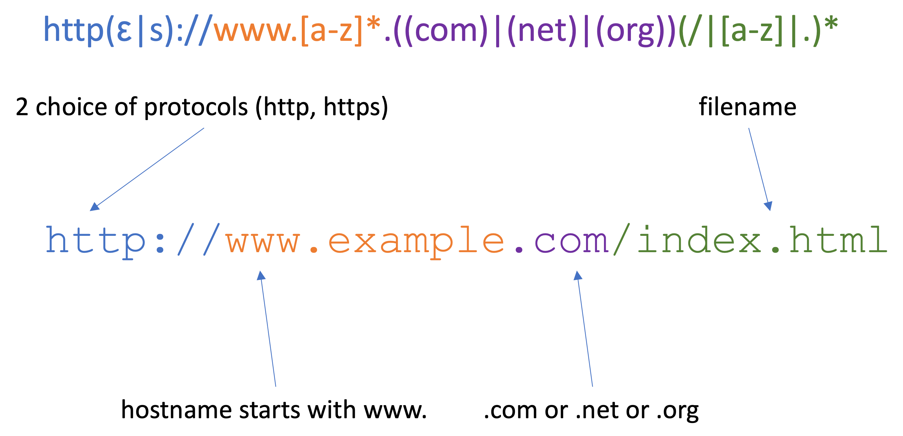

# Regular Grammars and Regular Expressions

Before moving onto parsing, we take one detour through as class of grammars that is *weaker* than context-free grammars (the grammars described by BNF specifications) but surprisingly useful.

> **Definition.** A **(right linear) regular grammar** is one given by a BNF specification with the only the following kinds of rules.
> * `<non-term> ::= term`
> * `<non-term> ::= term | <other-non-term>` where `<other-non-term>` may be the same as `<non-term>`
> * `<non-term> ::= EMPTY` where `EMPTY` is a special symbol representing the empty sequence.

It is not difficult to imagine what a left linear regular grammar would be, but we won't be too concerned with this.
Here is a simple example of a regular grammar.

```
<s> ::= a<s>
<s> ::= b<a>
<a> ::= EMPTY
<a> ::= c<a>
```

One key feature of regular grammars is that their derivations are very nicely structured.
At each step, there is always a single non-terminal symbol in the rightmost position which is either shifted over by a terminal symbol or dropped (i.e., replaced with `EMPTY`).

```
<s>
a<s>
aa<s>
aaa<s>
aaab<a>
aaabc<a>
aaabcc<a>
aaabccc<a>
aaabcccc<a>
aaabcccc
```

> **Exercise.** Give a derivation of `abcc` in the above grammar.
> Is `b` a sentence of the above grammar?

Another key feature is that they have a very compact representation, which can be seen to parallel the extensions to BNF we gave in the previous section.

> **Definition.** A **regular expression** is defined as follows.
> * A terminal symbol is a regular expression.
> * If `e` and `f` are regular expressions, then so are
>   * `(e|f)` (alternative)
>   * `(ef)` (sequence)
>   * `e*` (zero-or-more repetition, a.k.a., the Kleene star)
>
> A regular expression `e` **recognizes** sentences according to the following rules.
> * A terminal symbol `term` recognizes the the sentence `term`.
> * if `e` recognizes `s`, then `e|f` recognizes `s`.
> * if `f` recognizes `s`, then `e|f` recognizes `s`.
> * if `e` recognizes `s` and `f` recognizes `t`, then `(ef)` recognizes `st`
> * `e*` recognizes `EMPTY`
> * if `e` recognizes `s_1`, `s_2`,...,`s_k` then `e*` recognizes `s_1s_2...s_k`


We're not going to talk about the translation between these two representations, but it is a theorem of formal language theory that *every regular grammar can be represented regular expression and vice versa*.
This is to say, given a regular grammar, we can find a regular expression which recognizes the same sentences (and vice versa).

> **Example.** We might notice that the above grammar has the property that it recognizes any sentence which is made up of any number of `a`s followed by a single `b` followed by any number of `c`s.
> This is represented by the regular expression `(a*bc*)`.
> We will often drop outer parentheses, so that we could also write the regular expression `a*bc*`.

> **Example.** The regular expression `a((bc)|(cb))*d` recognizes the sentence `abccbd`.
> This sentence contains a single `a`, followed by to repetitions of either `bc` or `cb` (the first `bc`, the second `cb`), followed by a single `d`.

## A More Interesting Example: URLs


