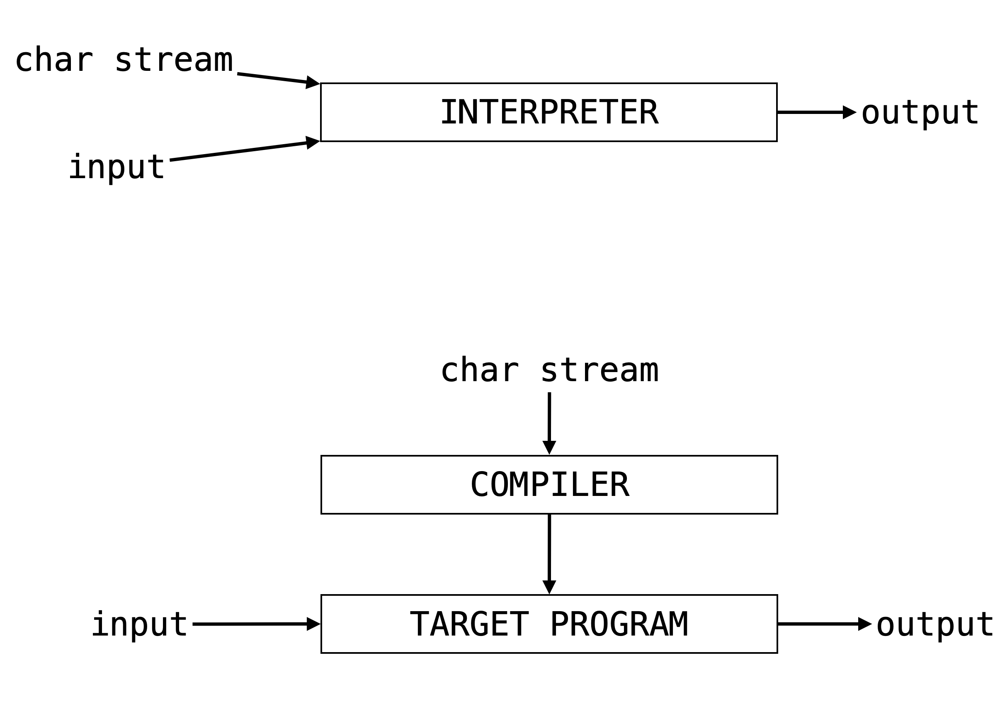
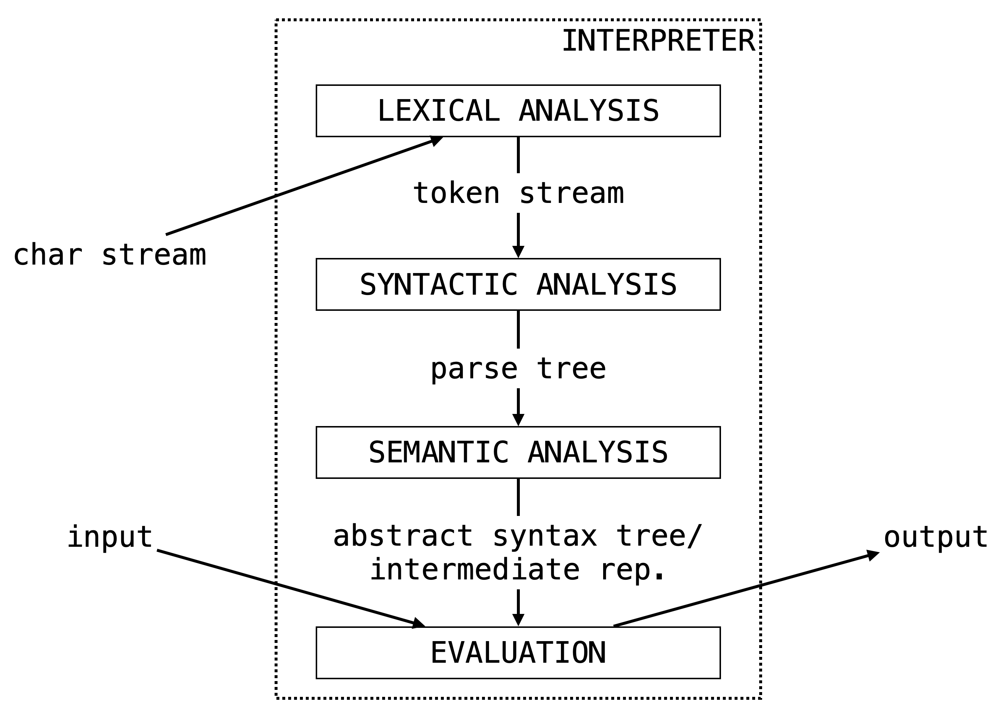

# Introduction

When we go to write a program in our favorite programming language (OCaml, I presume) we fill a file with a bunch of symbols and text.
This is one of the beauties of programming: looking past the bells and whistles provided by editors and IDEs, a program is just a stream of characters.

At some point in our programming workflow (hopefully not the very end) we want to verify that what we've written thus far actually works, so we *run* our program.
In some IDEs, this literally means pressing a play button.
For more down-to-earth setups, this might mean opening up a terminal and typing out a few commands.

In either case, we are running a *different* program in order to run the program we've written (huh).
Our goal is to understand what's going on here: *What is this program doing? How does it do it? What sorts of data structures does this program use? etc., etc.*

Our intuition should probably tell us this program is doing something fairly complicated.
Just imagine how hard it is for us as humans (and, more specifically, students) to follow directions.
How often do we find ourselves wishing we had read *all* the instructions before starting on some task (like we we're told to do)?

**So, our basic question:** *How do we get from that stream of symbols to the **output** of our program?*

## Interpretation vs. Compilation

We start by making a loose but ultimately important distinction, that of *interpretation* versus *compilation*.
At the risk of oversimplicating the issue, we will use the following definitions to distinguish between these two processes.

> **Interpretation** is the process of of taking a source program and its input, and then running it immediately to get its output.

In the case of compilation we're not immediately interested in the output of our program, but rather punt that concern to a different process.

> **Compilation** is the process of taking a source program in a high-level language and then *translating it* into a program in a low-level language which can given input and run separately.

These processes are often represented by the following ubiquitous (verging on patronizingly) simple diagrams.

Again, this is a loose distinction, e.g., there may be intermediate translations in the process of intepretation.
We will look briefly at compilation towards the end of the course, but we start by focusing on interpretation.

## Pure Interpretation Pipeline

So, *what's happening inside an interpreter?*
We start (as is typically the case) with a high-level diagram.
We can think of this image as providing a window into the "Interpreter" box above.

A lot to parse here (pun intended), but this also gives us an outline of what is to come in the remainder of these notes:

* The first two boxes turn that sequences of characters we've written into something that is easy to evaluate, easy to "run".
  This part of intepretation is about the *form* (or *syntax*) of the program.
  We use **Formal Grammars** (Chapter 2) to represent this form, i.e., to describe the result of **Parsing** (Chapter 3).
  Just like natural language, programming languages are heirarchical, and representing that heirarchical structure explicitly will make it easier to evaluate the program.

* The next two boxes take the heirarchical structure gotten by analyzing the syntax of our program, and then evaluate it (run it) to get its output (possibly building an intermediate representation).
  This part of intperetation is about the *meaning* (or *semantics*) of the program.
  We use **Formal Semantics** (Chapter 4) to describe what it means to give a program this meaning.
  This is where we need to concern ourselves with how **Variables** (Chapter 5) are handled and how function calls are made (i.e., how **Subprograms** (Chapter 6) are run).

As we will see, some of these steps are skipped (with parser combinators, it is often possible to perform lexical analysis alongside parsing) or added to (by the end of the course, we will include a compilation step as part of semantic analysis).
The hope is just that we are starting to think more carefully about what is going on when our programs are run.

## What's Next

Programming languages form is one of these topics that has incredibly deep implication both in theory and in practice.
It will be important to us not just to think about how to implement an interpreter, but also about the underlying logical frameworks we need for programming languages to make sense.

So there will be a frequent give-and-take here between theory and practice.
Be prepared to do handwritten assignments (not quite proofs, but something akin to them) as well as programming assignments (i.e., building the components interpreter).

We begin with the study of **Formal Grammar**, the basis of parsing (and also of theoretical linguistics).
